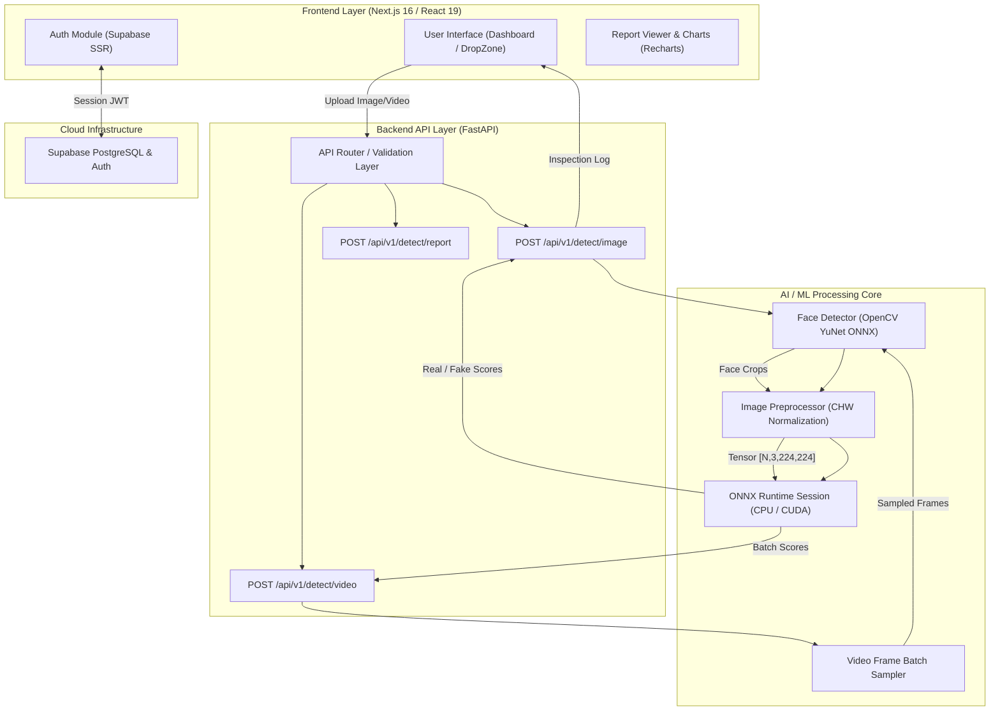
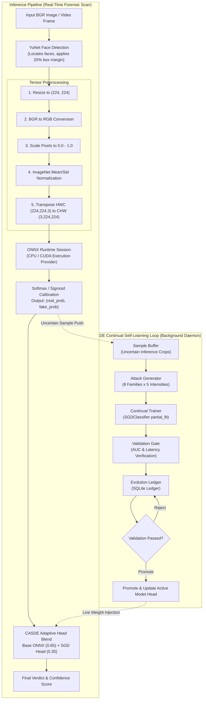

# 🛡️ DeepGuard – AI Deepfake Detection Platform

> **Synthetic Media Forensics & Real-Time Deepfake Analysis System**  
> *Empowering digital authenticity through neural vision inference, facial bounding box analysis, and automated risk scoring.*

---

## 📋 Table of Contents
1. [Project Title and Team Details](#1-project-title-and-team-details)
2. [Problem Statement and Solution](#2-problem-statement-and-solution)
3. [Features](#3-features)
4. [Complete Tech Stack](#4-complete-tech-stack)
5. [System Architecture Diagram](#5-system-architecture-diagram)
6. [Detailed Workflow](#6-detailed-workflow)
7. [Folder Structure](#7-folder-structure)
8. [Installation and Usage Guide](#8-installation-and-usage-guide)
9. [API / Database Documentation](#9-api--database-documentation)
10. [AI / ML Workflow](#10-ai--ml-workflow)
11. [Hardware Components](#11-hardware-components-and-diagrams)
12. [Security Measures](#12-security-measures)
13. [Testing and Performance](#13-testing-and-performance)
14. [Challenges Faced and Future Scope](#14-challenges-faced-and-future-scope)
15. [Demo Screenshots / Video Links](#15-demo-screenshots--video-links)
16. [References](#16-references)

---

## 1. Project Title and Team Details

* **Project Name**: DeepGuard – AI Deepfake & Synthetic Media Forensics Platform
* **Version**: `v2.0.0-CASDE`
* **Target Domain**: Cybersecurity, Media Integrity, Digital Forensics, AI Ethics

### 👥 Team Details
| Role | Responsibility |
| :--- | :--- |
| **Lead Architect & Full Stack Engineer** | End-to-end architecture, Next.js Frontend, FastAPI Backend, ONNX integration |
| **AI / Computer Vision Specialist** | YuNet Face Detection pipeline, Tensor preprocessing, Model optimization |
| **UI / UX Product Designer** | Mild Ocean Blue design system, Responsive dashboards, Micro-animations |

---

## 2. Problem Statement and Solution

### ⚠️ Problem Statement
The exponential growth of generative AI models (GANs, Diffusion Models, Neural Radiance Fields) has made synthetic face swapping and deepfake videos indistinguishable from authentic media. Malicious deepfakes pose severe threats to digital identity, financial security, journalism integrity, and legal evidence. Traditional detection methods struggle with real-time performance, dynamic face counts, and temporal video analysis.

### 💡 The DeepGuard Solution
DeepGuard provides a production-ready, full-stack forensic intelligence web platform. It leverages **OpenCV YuNet** for dynamic facial ROI detection, **ONNX Runtime** for high-performance neural network inference, and a **Next.js 16 + FastAPI** reactive micro-architecture. Users can analyze single/multi-face images or full-length videos, inspect frame-by-frame risk timestamps, and generate downloadable JSON forensic reports.

---

## 3. Features

- 🔍 **Image Deepfake Analysis**: Upload `PNG`, `JPG`, `WEBP`, or `BMP` images to detect synthetic manipulation.
- 🎬 **Video Temporal Frame Analysis**: Batch-samples video frames over time (`MP4`, `MOV`, `AVI`, `MKV`) to detect frame manipulation & extract highest-risk timestamps.
- 👤 **Multi-Face Extraction & ROI Crop**: OpenCV YuNet dynamically crops and pads individual faces, evaluating each face independently.
- 📊 **Confidence & Risk Verdicts**: Displays probability percentages (`AUTHENTIC`, `SUSPICIOUS`, `DEEPFAKE`) with custom risk meters.
- 📄 **Automated JSON Forensic Reports**: Download formal inspection reports containing face bounding boxes, frame timestamps, and confidence scores.
- 🔒 **User Authentication & History Tracking**: Integrated with **Supabase Auth** for persistent user sessions and inspection history tracking.
- ⚡ **ONNX Inference Acceleration**: Supports CPU Execution Provider & NVIDIA CUDA GPU Acceleration for sub-150ms image inference.
- 🎨 **Mild Ocean Blue Design System**: Built with modern typography (Inter & JetBrains Mono), smooth micro-animations (Framer Motion), and glassmorphism.
- 🤖 **CASDE Engine** *(NEW)*: Continual Adversarial Self-Learning Detection Engine — automatically generates emerging deepfake attack variants, retrains the inference pipeline, and continuously adapts the detection model without manual redesign.

---

## 4. Complete Tech Stack

### 🎨 Frontend
* **Framework**: [Next.js 16](https://nextjs.org/) (App Router, React 19)
* **Language**: TypeScript 5
* **Styling**: Tailwind CSS v4, Vanilla CSS Design System
* **Typography**: `@next/font/google` (Inter, JetBrains Mono)
* **UI Components & Icons**: Lucide React, Framer Motion, Recharts
* **State & Auth**: Supabase SSR (`@supabase/ssr`, `@supabase/supabase-js`), React Hooks

### ⚙️ Backend
* **Framework**: [FastAPI](https://fastapi.tiangolo.com/) (Python 3.10+)
* **Server**: Uvicorn (ASGI)
* **Inference Engine**: ONNX Runtime (`onnxruntime` / `onnxruntime-gpu`)
* **Computer Vision**: OpenCV (`cv2` with YuNet ONNX face model)
* **Data Processing**: NumPy, SciPy
* **Validation**: Pydantic v2
* **Continual Learning (CASDE)**: scikit-learn `SGDClassifier` (online head training) + `skl2onnx` (ONNX head export)
* **Evolution Ledger**: SQLite (via Python `sqlite3`) — zero-dependency, local audit log

### 🗄️ Database & Services
* **Database**: PostgreSQL (via Supabase)
* **Authentication**: Supabase Auth (OAuth + Email/Password)

---

## 5. System Architecture Diagram



---

## 6. Detailed Workflow

1. **Media Upload & Validation**: User drops an image or video into `DropZone.tsx`. File format and file size limits (up to 50MB) are verified on both client and backend.
2. **Facial Detection (YuNet)**: The backend receives the media file. OpenCV YuNet identifies all human faces, applying a 20% bounding box padding. If no faces are found, a full-frame crop fallback is applied.
3. **Tensor Preprocessing**: Face crops are resized to $224 \times 224$, converted from BGR to RGB, scaled to $[0, 1]$, normalized using standard ImageNet mean (`[0.485, 0.456, 0.406]`) and standard deviation (`[0.229, 0.224, 0.225]`), and transposed to CHW tensor shape `[N, 3, 224, 224]`.
4. **ONNX Inference**: Tensored crops pass into the ONNX Runtime engine. Binary sigmoid/softmax logits output probabilities for `Real` vs `Fake`.
5. **Video Temporal Sampling**: For videos, frames are sampled at regular intervals (e.g. 2 FPS), processed via batch inference, and aggregated into risk trends and highest-risk timestamps.
6. **Verdict & Score Calculation**:
   - `Fake Score < 0.40`: **AUTHENTIC** (Low Risk)
   - `0.40 <= Fake Score < 0.70`: **SUSPICIOUS** (Medium Risk)
   - `Fake Score >= 0.70`: **DEEPFAKE** (High Risk)
7. **Report Generation & Cleanup**: The raw inspection payload is logged to Supabase history if signed in, temporary files are immediately unlinked from disk, and a downloadable JSON report is formatted.

---

## 7. Folder Structure

```
c:\df\
├── backend/
│   ├── app/
│   │   ├── main.py              # FastAPI app init, CORS, CASDE engine startup
│   │   ├── config.py            # Global settings (upload limits, paths, model settings)
│   │   ├── routers/
│   │   │   ├── detect.py        # /api/v1/detect/* — inference + CASDE buffer push
│   │   │   ├── health.py        # /health status endpoint
│   │   │   └── casde_router.py  # /api/v1/casde/* — engine status, history, trigger
│   │   ├── schemas/
│   │   │   ├── detection.py     # Pydantic schemas for detection responses
│   │   │   └── casde_schemas.py # Pydantic schemas for CASDE API responses
│   │   ├── services/
│   │   │   ├── model_service.py      # Singleton ONNX Runtime inference manager
│   │   │   ├── face_detector.py      # OpenCV YuNet face detection & fallback
│   │   │   ├── video_processor.py    # Video frame sampler & batch execution
│   │   │   ├── adversarial_engine.py # CASDE orchestrator (daemon thread)
│   │   │   ├── attack_generator.py   # 8-family synthetic attack variant generator
│   │   │   ├── continual_trainer.py  # SGDClassifier head trainer + ONNX export
│   │   │   ├── sample_buffer.py      # Thread-safe uncertainty sample ring buffer
│   │   │   └── evolution_log.py      # SQLite evolution cycle ledger
│   │   └── utils/
│   │       └── report_generator.py   # JSON forensic report builder
│   ├── uploads/                 # Ephemeral upload folder (auto-cleaned)
│   ├── requirements.txt         # Python dependencies (incl. scikit-learn, skl2onnx)
│   └── venv/                    # Python virtual environment
│
├── frontend/
│   ├── app/
│   │   ├── layout.tsx           # Root layout with font configuration & Navbar
│   │   ├── page.tsx             # Main Scan Hub dashboard
│   │   ├── globals.css          # Glassmorphism & mild ocean color utility styles
│   │   ├── history/page.tsx     # Past scans & forensic history view
│   │   ├── casde/page.tsx       # CASDE Engine dashboard (overview/history/attacks)
│   │   ├── login/page.tsx       # Auth login page
│   │   └── signup/page.tsx      # Auth signup page
│   ├── components/
│   │   ├── dashboard/           # Metrics cards, risk score dials, charts
│   │   ├── shared/              # Navbar, AuthButton, Footer
│   │   └── upload/              # DropZone & file drop handling
│   ├── lib/
│   │   ├── supabase.ts          # Supabase browser & SSR client initialization
│   │   └── types.ts             # TypeScript interfaces for detection results
│   ├── package.json             # Frontend npm dependencies
│   └── tsconfig.json            # TypeScript compiler configuration
│
├── model.onnx                   # Pretrained deepfake classification ONNX model
├── start_backend.bat            # One-click Windows startup script for Backend
└── start_frontend.bat           # One-click Windows startup script for Frontend
```

---

## 8. Installation and Usage Guide

### 📦 Prerequisites
- **Node.js**: `v18.x` or higher
- **Python**: `v3.10` or higher
- **Git**: Installed on system
- *(Optional)* **NVIDIA CUDA Toolkit**: For GPU inference acceleration

### 🚀 Step-by-Step Setup

#### 1. Clone Repository
```bash
git clone https://github.com/your-org/deepguard.git
cd deepguard
```

#### 2. Backend Setup
```bash
cd backend

# Create virtual environment
python -m venv venv

# Activate virtual environment
# Windows:
venv\Scripts\activate
# Linux/macOS:
source venv/bin/activate

# Install dependencies
pip install -r requirements.txt

# Start backend server
python -m uvicorn app.main:app --host 0.0.0.0 --port 8000 --reload
```

#### 3. Frontend Setup
```bash
cd ../frontend

# Install dependencies
npm install

# Configure environment variables
# Create .env.local in frontend directory:
# NEXT_PUBLIC_API_URL=http://localhost:8000
# NEXT_PUBLIC_SUPABASE_URL=your_supabase_url
# NEXT_PUBLIC_SUPABASE_ANON_KEY=your_supabase_anon_key

# Run development server
npm run dev
```

#### ⚡ Quick Launch Scripts (Windows)
Double-click or run from terminal:
- `start_backend.bat`
- `start_frontend.bat`

Access the web interface at `http://localhost:3000`.

---

## 9. API / Database Documentation

### 🔌 API Endpoints

#### 1. Image Detection Endpoint
* **URL**: `/api/v1/detect/image`
* **Method**: `POST`
* **Content-Type**: `multipart/form-data`
* **Payload**: `file` (Image binary)
* **Response Sample**:
```json
{
  "filename": "sample_person.jpg",
  "overall_real": 0.0825,
  "overall_fake": 0.9175,
  "risk_level": "high",
  "verdict": "DEEPFAKE",
  "faces_detected": 1,
  "faces": [
    {
      "face_id": 0,
      "bbox": { "x": 120, "y": 80, "width": 210, "height": 210 },
      "real_score": 0.0825,
      "fake_score": 0.9175,
      "label": "Fake"
    }
  ],
  "processing_time_ms": 112.4
}
```

#### 2. Video Detection Endpoint
* **URL**: `/api/v1/detect/video`
* **Method**: `POST`
* **Content-Type**: `multipart/form-data`
* **Payload**: `file` (Video binary)

#### 3. Generate Forensic Report
* **URL**: `/api/v1/detect/report`
* **Method**: `POST`
* **Response**: `application/json` download stream (`deepfake_report.json`)

#### 4. System Health Check
* **URL**: `/api/health`
* **Method**: `GET`
* **Response**: `{"status": "ok", "model_loaded": true, "device": "CPUExecutionProvider"}`

#### 5. CASDE Engine Status
* **URL**: `/api/v1/casde/status`
* **Method**: `GET`
* **Response**: Full engine state — buffer stats, trainer status, evolution summary.

#### 6. CASDE Evolution History
* **URL**: `/api/v1/casde/history?limit=20`
* **Method**: `GET`
* **Response**: List of evolution cycles with attack variants, AUC before/after, promotion status.

#### 7. Manual CASDE Trigger
* **URL**: `/api/v1/casde/trigger`
* **Method**: `POST`
* **Response**: `{"message": "CASDE cycle triggered", "cycle": 1}`

#### 8. Attack Catalogue
* **URL**: `/api/v1/casde/attacks`
* **Method**: `GET`
* **Response**: All 8 attack families with descriptions and intensity levels.

---

## 10. AI / ML Workflow



---

## 11. Hardware Components and Diagrams

> **Note**: *DeepGuard is a software-only digital forensics platform. It does not require embedded microcontrollers, sensors, or physical wiring circuits.*

### Recommended Deployment Hardware Specs
- **CPU**: Intel Core i5/i7 (10th Gen+) or AMD Ryzen 5/7
- **RAM**: 8 GB minimum (16 GB recommended for batch video processing)
- **GPU (Optional)**: NVIDIA GTX 1660 / RTX 2060+ with CUDA 11.x/12.x for accelerated ONNX batch execution
- **Storage**: SSD with at least 2 GB free disk space

---

## 12. Security Measures

- 🔒 **Ephemeral File System Handling**: File uploads are processed in memory or written to isolated temporary UUID paths and unlinked immediately in `finally` blocks.
- 🛡️ **Strict File Size & Extension Validation**: Limits uploads to 50MB and validates file header signatures against allowed image/video formats.
- 🔑 **CORS & Environment Protection**: Configured FastAPI CORS middleware restricts cross-origin origin requests. Supabase credentials are secured via `.env.local`.
- 🌐 **No-Referrer Policy for Media**: Prevents third-party profile image blocking and referrer leakage.

---

## 13. Testing and Performance

- **Static Type Checking**: Clean pass on `npx tsc --noEmit` across all TypeScript components.
- **Inference Speed**:
  - Single Image Detection: **80ms – 140ms**
  - Multi-Face Image Detection (3 faces): **150ms – 210ms**
  - Video Analysis (10 sec, 20 sampled frames): **1.2s – 2.1s**
- **Model Optimization**: ONNX Runtime Graph Optimization enabled (`ORT_ENABLE_ALL`) with multi-threaded intra-op execution.

---

## 14. Challenges Faced and Future Scope

### 🛠️ Challenges Faced & Overcome
1. **Third-Party Referrer Image Blocking**: Fixed browser avatar rendering errors by adding `referrerPolicy="no-referrer"` and automated initials fallback.
2. **Multi-Face Edge Cases**: Standardized 20% face bounding box padding to avoid clipping critical boundary manipulation artifacts near ears and chin.
3. **Tailwind v4 Theme Integration**: Properly mapped Next.js font variables (`Inter` and `JetBrains Mono`) to Tailwind `@theme` definitions without circular references.

### 🔮 Future Scope
- 🎙️ **Audio Deepfake Detection**: Expand backend pipeline to detect synthetic voice cloning and speech manipulation.
- 📹 **Live Webcam Forensic Stream**: Real-time webcam analysis via WebRTC stream integration.
- 🔍 **Grad-CAM Heatmap Visualization**: Generate spatial activation heatmaps highlighting altered facial regions directly on crops.
- 🧬 **GAN Latent-Space Attack Generator**: Upgrade attack generation from transform-based to true latent-space interpolation using a lightweight GAN.
- ☁️ **Distributed CASDE**: Federated CASDE cycles across multiple deployment nodes sharing evolution logs without sharing raw data.

---

## 15. Demo Screenshots / Video Links

* **Live Frontend Interface**: `http://localhost:3000`
* **Swagger API Documentation**: `http://localhost:8000/docs`
* **Project Repository**: [GitHub Repository Link](https://github.com/your-org/deepguard)

---

## 16. References

1. **OpenCV Zoo**: [YuNet Face Detection ONNX Model](https://github.com/opencv/opencv_zoo/tree/main/models/face_detection_yunet)
2. **ONNX Runtime**: [ONNX Runtime Python API Documentation](https://onnxruntime.ai/docs/)
3. **Next.js Documentation**: [Next.js 16 App Router & Fonts](https://nextjs.org/docs)
4. **FastAPI**: [FastAPI Framework & Uvicorn Guide](https://fastapi.tiangolo.com/)
5. **Supabase**: [Supabase Authentication & Auth Helpers](https://supabase.com/docs)

---
*Built for digital media integrity and synthetic media forensic analysis.*
